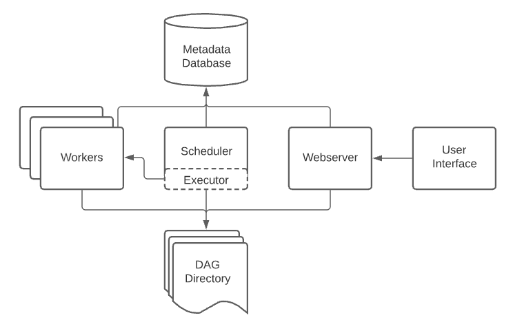

## Airflow Concepts & Architecture 

[🎦 Video](youtube.com/watch?v=lqDMzReAtrw&list=PL3MmuxUbc_hJed7dXYoJw8DoCuVHhGEQb&index=18)

A typical Airflow installation consists of the following components: 

- **Scheduler**: The main "core" of Airflow. Manages workflow execution. Triggers scheduled workflows and submits tasks to the executor to run. Monitors DAGs and task states and ensures dependencies are respected. 
  
- **Executor**: Handles running tasks. In default setup, executor runs everything inside the scheduler. But in most production-grade Airflow environments, executor pushes task execution out to workers. 
  
- **Worker**: Executes any task given by the Executor. 

- **Webserver**: GUI to inspect, trigger, and debug DAGs and tasks.  Available at [http://localhost:8080](http://localhost:8080).

- **Metadata Database (Postgres)**: Used by scheduler, executor, and web server to store the state of DAGs and tasks. The "backend" of Airflow. 

- **Other Services**  
  - **Redis**: Message broker, forwards messages from scheduler to worker.  
  - **Flower**: Real-time monitoring dashboard, available at [http://localhost:5555](http://localhost:5555).  
  - **airflow-init**: Initialization service (we will customize for our needs in this example).

### Airflow Architecture

**Refs:** [Airflow Concepts Overview](https://airflow.apache.org/docs/apache-airflow/stable/concepts/overview.html), [Architecture Overview](https://airflow.apache.org/docs/apache-airflow/stable/concepts/overview.html) 

### Project Structure
---
Airflow creates the following folder structure when running: 

* `./dags` - `DAG_FOLDER` for DAG files (use `./dags_local` for the local ingestion DAG)
* `./logs` - contains logs from task execution and scheduler.
* `./plugins` - for custom plugins

### Workflow Components
---

* `DAG`: Directed Acyclic Graph. 
  * A DAG specifies the dependencies between a set of tasks with an explicit execution order.
  * A DAG has a beginning and an end. (Hence, “acyclic”). 

- **DAG Structure** 
     - DAG Definition, 
     - Tasks (eg. Operators), 
     - Task Dependencies (control flow: `>>` or `<<` )
    
* `Task`: a defined unit of work (aka, operators in Airflow). The Tasks themselves describe what to do, be it fetching data, running analysis, triggering other systems, or more. Common Types of Tasks are: 
    * **Operators** - predefined tasks. The most common (and used in this workshop). 
    * **Sensors** - subclass of Operators which wait for external events to happen. 
    * **TaskFlow decorators** (subclass of Airflow's BaseOperator) - custom Python functions packaged as Tasks. 

* `DAG Run`: individual execution/run of a DAG. A run can be scheduled or triggered. 

* `Task Instance`: an individual run of a single task. Task instances also have an indicative state, which could be `running`, `success`, `failed`, `skipped`, `up for retry`, etc.
    * Ideally, a task should flow from `none`, to `scheduled`, to `queued`, to `running`, and finally to `success`.

### References
---
- [Apache Airflow Concepts - DAGs](https://airflow.apache.org/docs/apache-airflow/stable/concepts/dags.html)
- [Apache Airflow Concepts - Tasks](https://airflow.apache.org/docs/apache-airflow/stable/concepts/tasks.html)

